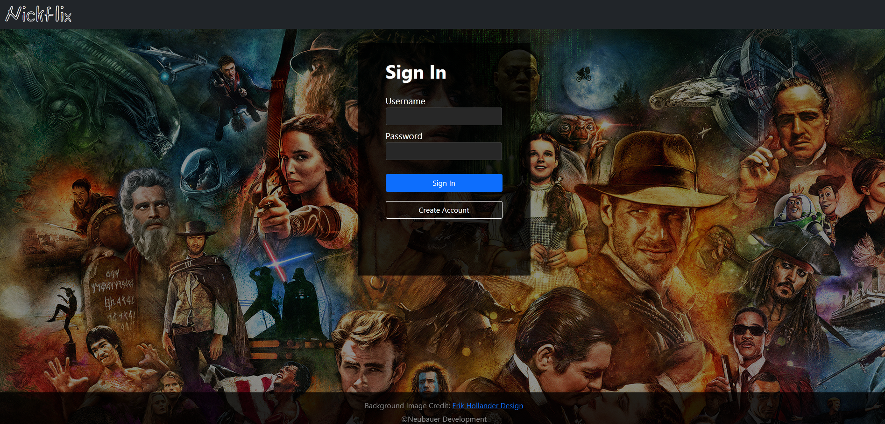

# Nickflix-Client
Nickflix is a client side application built using ReactJS for server-side api. Nickflix is a responsive single page application that displays a list of movies for registered users. Users are allowed to view movie details including: release year, genres, director information, and plot. Information about the genre or director is displayed in their own views. A user may also generate a list of favorite movies and update their information. 

Nickflix URL: &nbsp; https://nickflixmovieinfo.netlify.app

 

# Application Features
1. Login and Registration with client & server-side error handeling
2. Displays a list of movies by their film poster
3. Movies can be searched by title in the movie list view
4. Users can click the film poster to display more details about the film
5. Users can click the genre or director buttons to display a definition of genre or information about the director of the film
6. Users can add/remove the selected movie to their favorites list
7. Users can update their user information

 

 

## Build Tool
* Parcel V2.0.0
* Entry point src/index.html

